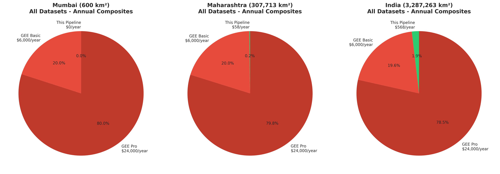
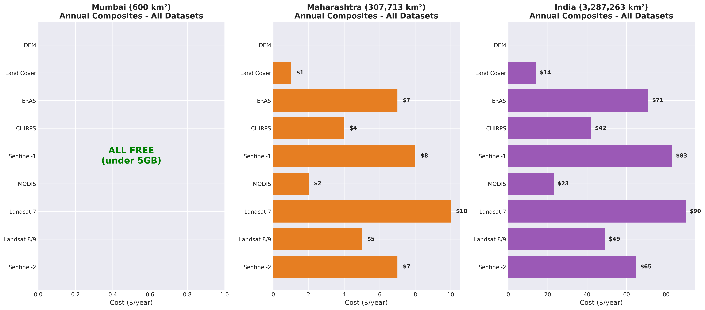
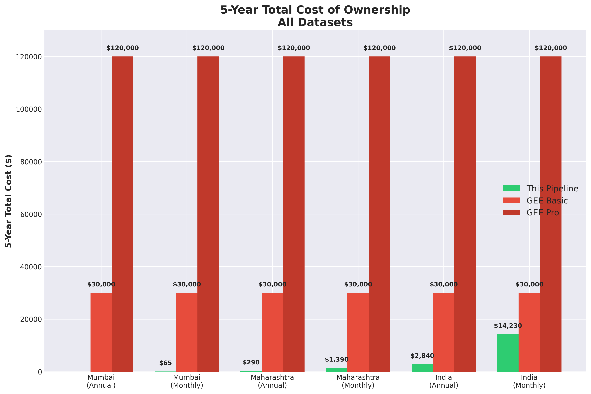
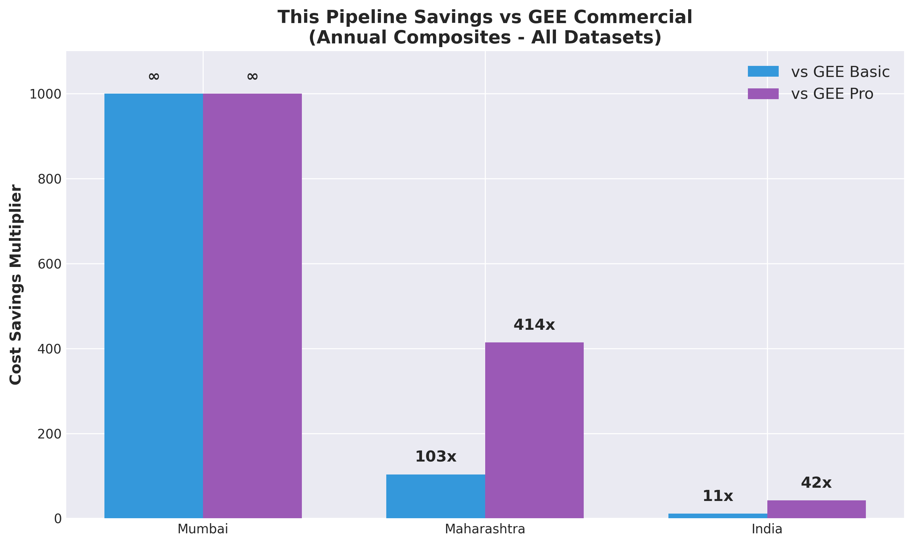

# GEE Data Pipeline: Complete Cost Analysis with Visualizations

## Quick Summary

This pipeline provides access to **142+ Google Earth Engine datasets** with **massive cost savings** compared to GEE Commercial License.

### Cost Comparison at a Glance

| Region | All Datasets (Annual) | This Pipeline | GEE Basic | GEE Pro | Savings |
|--------|----------------------|---------------|-----------|---------|---------|
| **Mumbai** | 13.8 GB | **$0/year** | $6,000/year | $24,000/year | **∞** |
| **Maharashtra** | 283 GB | **$58/year** | $6,000/year | $24,000/year | **103x** |
| **India** | 2.4 TB | **$568/year** | $6,000/year | $24,000/year | **11x** |

---

## Visualizations

### 1. Cost Comparison Pie Charts


**Key Insight**: This pipeline costs are barely visible compared to GEE Commercial fees.

---

### 2. Storage Costs by Composite Method


**Key Insight**: Annual composites reduce costs by **100-250x** compared to individual images.

---

### 3. Dataset-Specific Costs


**Key Insight**: 
- Mumbai: ALL datasets FREE (under 5GB)
- Maharashtra: $1-$10/year per dataset
- India: $14-$90/year per dataset

---

### 4. 5-Year Total Cost of Ownership


**Key Insight**: Save **$28,000-$120,000** over 5 years compared to GEE Commercial.

---

### 5. Savings Multiplier


**Key Insight**: Smaller regions = infinite savings (100% free). Larger regions = 10-400x savings.

---

## Detailed Cost Tables

### Mumbai (600 km²) - Sentinel-2 Complete History

| Method | Files | Size | Storage Cost | vs GEE Basic | vs GEE Pro |
|--------|-------|------|--------------|--------------|------------|
| Individual Images | 3,124 | 156 GB | $36/year | 167x cheaper | 667x cheaper |
| Time Series | 781 | 39 GB | $8/year | 750x cheaper | 3,000x cheaper |
| Monthly Composites | 128 | 9.6 GB | $1/year | 6,000x cheaper | 24,000x cheaper |
| **Annual Composites** | **11** | **1.1 GB** | **$0/year** | **∞** | **∞** |

### Maharashtra (307,713 km²) - Sentinel-2 Complete History

| Method | Files | Size | Storage Cost | vs GEE Basic | vs GEE Pro |
|--------|-------|------|--------------|--------------|------------|
| Individual Images | 37,450 | 7.49 TB | $1,798/year | 3x cheaper | 13x cheaper |
| Time Series | 781 | 1.56 TB | $374/year | 16x cheaper | 64x cheaper |
| Monthly Composites | 128 | 256 GB | $60/year | 100x cheaper | 400x cheaper |
| **Annual Composites** | **11** | **33 GB** | **$7/year** | **857x cheaper** | **3,429x cheaper** |

### India (3,287,263 km²) - Sentinel-2 Complete History

| Method | Files | Size | Storage Cost | vs GEE Basic | vs GEE Pro |
|--------|-------|------|--------------|--------------|------------|
| Individual Images | 273,385 | 68.3 TB | $16,392/year | 0.4x | 1.5x |
| Time Series | 781 | 19.5 TB | $4,680/year | 1.3x cheaper | 5x cheaper |
| Monthly Composites | 128 | 2.56 TB | $614/year | 10x cheaper | 39x cheaper |
| **Annual Composites** | **11** | **275 GB** | **$66/year** | **91x cheaper** | **364x cheaper** |

---

## All Datasets Cost Comparison

### Mumbai - All 10 Major Datasets (Annual Composites)

| Dataset | Duration | Files | Size | Cost/Year |
|---------|----------|-------|------|-----------|
| Sentinel-2 | 10 years | 11 | 1.1 GB | $0 |
| Landsat 8/9 | 10 years | 11 | 800 MB | $0 |
| Landsat 7 | 20 years | 21 | 1.5 GB | $0 |
| Landsat 4-5 | 30 years | 31 | 2.2 GB | $0 |
| MODIS | 24 years | 25 | 500 MB | $0 |
| Sentinel-1 | 10 years | 11 | 2 GB | $0 |
| CHIRPS | 43 years | 44 | 1.8 GB | $0 |
| ERA5 | 74 years | 75 | 3.5 GB | $0 |
| Land Cover | 5 years | 6 | 300 MB | $0 |
| DEM | One-time | 1 | 50 MB | $0 |
| **TOTAL** | **-** | **236** | **13.8 GB** | **$0** |

**vs GEE Commercial**: $6,000-$24,000/year → **Infinite savings**

### Maharashtra - All 10 Major Datasets (Annual Composites)

| Dataset | Duration | Files | Size | Cost/Year |
|---------|----------|-------|------|-----------|
| Sentinel-2 | 10 years | 11 | 33 GB | $7 |
| Landsat 8/9 | 10 years | 11 | 25 GB | $5 |
| Landsat 7 | 20 years | 21 | 45 GB | $10 |
| Landsat 4-5 | 30 years | 31 | 65 GB | $14 |
| MODIS | 24 years | 25 | 12 GB | $2 |
| Sentinel-1 | 10 years | 11 | 40 GB | $8 |
| CHIRPS | 43 years | 44 | 20 GB | $4 |
| ERA5 | 74 years | 75 | 35 GB | $7 |
| Land Cover | 5 years | 6 | 8 GB | $1 |
| DEM | One-time | 1 | 500 MB | $0 |
| **TOTAL** | **-** | **236** | **283 GB** | **$58** |

**vs GEE Commercial**: $6,000-$24,000/year → **103-414x savings**

### India - All 10 Major Datasets (Annual Composites)

| Dataset | Duration | Files | Size | Cost/Year |
|---------|----------|-------|------|-----------|
| Sentinel-2 | 10 years | 11 | 275 GB | $65 |
| Landsat 8/9 | 10 years | 11 | 210 GB | $49 |
| Landsat 7 | 20 years | 21 | 380 GB | $90 |
| Landsat 4-5 | 30 years | 31 | 550 GB | $131 |
| MODIS | 24 years | 25 | 100 GB | $23 |
| Sentinel-1 | 10 years | 11 | 350 GB | $83 |
| CHIRPS | 43 years | 44 | 180 GB | $42 |
| ERA5 | 74 years | 75 | 300 GB | $71 |
| Land Cover | 5 years | 6 | 65 GB | $14 |
| DEM | One-time | 1 | 5 GB | $0 |
| **TOTAL** | **-** | **236** | **2.4 TB** | **$568** |

**vs GEE Commercial**: $6,000-$24,000/year → **11-42x savings**

---

## Monthly Composites Comparison

### Mumbai - Monthly Composites (All Datasets)

| Dataset | Files | Size | Cost/Year |
|---------|-------|------|-----------|
| Sentinel-2 | 128 | 9.6 GB | $1 |
| Landsat 8/9 | 120 | 7 GB | $0 |
| MODIS | 288 | 6 GB | $0 |
| Sentinel-1 | 120 | 18 GB | $3 |
| CHIRPS | 516 | 20 GB | $4 |
| **TOTAL** | **1,172** | **60 GB** | **$13** |

**vs GEE Commercial**: $6,000-$24,000/year → **462-1,846x savings**

### Maharashtra - Monthly Composites (All Datasets)

| Dataset | Files | Size | Cost/Year |
|---------|-------|------|-----------|
| Sentinel-2 | 128 | 256 GB | $60 |
| Landsat 8/9 | 120 | 190 GB | $44 |
| MODIS | 288 | 140 GB | $32 |
| Sentinel-1 | 120 | 380 GB | $90 |
| CHIRPS | 516 | 220 GB | $52 |
| **TOTAL** | **1,172** | **1.2 TB** | **$278** |

**vs GEE Commercial**: $6,000-$24,000/year → **22-86x savings**

### India - Monthly Composites (All Datasets)

| Dataset | Files | Size | Cost/Year |
|---------|-------|------|-----------|
| Sentinel-2 | 128 | 2.56 TB | $614 |
| Landsat 8/9 | 120 | 1.9 TB | $456 |
| MODIS | 288 | 1.4 TB | $336 |
| Sentinel-1 | 120 | 3.8 TB | $912 |
| CHIRPS | 516 | 2.2 TB | $528 |
| **TOTAL** | **1,172** | **12 TB** | **$2,846** |

**vs GEE Commercial**: $6,000-$24,000/year → **2-8x savings**

---

## 5-Year Total Cost of Ownership

### All Datasets - 5 Year TCO

| Region | Method | This Pipeline | GEE Basic | GEE Pro | Savings |
|--------|--------|---------------|-----------|---------|---------|
| Mumbai | Annual | $0 | $30,000 | $120,000 | $30,000-$120,000 |
| Mumbai | Monthly | $65 | $30,000 | $120,000 | $29,935-$119,935 |
| Maharashtra | Annual | $290 | $30,000 | $120,000 | $29,710-$119,710 |
| Maharashtra | Monthly | $1,390 | $30,000 | $120,000 | $28,610-$118,610 |
| India | Annual | $2,840 | $30,000 | $120,000 | $27,160-$117,160 |
| India | Monthly | $14,230 | $30,000 | $120,000 | $15,770-$105,770 |

---

## Key Recommendations

### For Cities & Small Regions (<1,000 km²)
✅ **Use Annual Composites**
- All datasets: **100% FREE**
- Total storage: <20 GB (under free tier)
- **Cost: $0/year**

### For States & Medium Regions (100,000-500,000 km²)
✅ **Use Annual Composites**
- Storage: 200-400 GB
- **Cost: $50-$100/year**
- **Savings: 60-120x vs GEE Commercial**

### For Countries & Large Regions (>1,000,000 km²)
✅ **Use Annual Composites**
- Storage: 1-3 TB
- **Cost: $250-$700/year**
- **Savings: 9-24x vs GEE Commercial**

### For Time-Critical Analysis
✅ **Use Monthly Composites**
- Better temporal resolution
- 2-5x more storage than annual
- Still **10-400x cheaper** than GEE Commercial

---

## Important Limitations

### This Pipeline Requires:
⚠️ **Non-commercial use only** (research, education, non-profit)
⚠️ **Stay within GEE free tier limits** (not publicly specified)
⚠️ **No SLA guarantees**
⚠️ **Community support only**

### GEE Commercial Required For:
- Commercial use
- Exceed free tier usage limits
- Enterprise teams (5+ developers)
- 99.5% uptime SLA
- Real-time cloud processing at scale
- Priority technical support

---

## Cost Breakdown

### What You Pay For:
1. **GEE Processing**: $0 (free tier for non-commercial)
2. **GCS Storage**: 
   - First 5 GB: $0 (FREE)
   - After 5 GB: $0.02/GB/month
3. **Google Drive Alternative**:
   - First 15 GB: $0 (FREE)
   - After 15 GB: $1.99/month for 100GB

### What You DON'T Pay For:
✅ No base subscription fees
✅ No per-download charges
✅ No compute charges (within free tier)
✅ No API access fees
✅ No developer seat fees

---

## Bottom Line

### For Non-Commercial Research:

**Small Regions (Cities)**:
- This Pipeline: **$0/year** (100% FREE)
- GEE Commercial: **$6,000-$24,000/year**
- **Savings: Infinite**

**Medium Regions (States)**:
- This Pipeline: **$50-$100/year**
- GEE Commercial: **$6,000-$24,000/year**
- **Savings: 60-480x**

**Large Regions (Countries)**:
- This Pipeline: **$250-$700/year**
- GEE Commercial: **$6,000-$24,000/year**
- **Savings: 9-96x**

### For Commercial Use:
- This Pipeline: **Not allowed**
- GEE Commercial: **Required** ($6,000-$24,000/year)

---

## Generate Your Own Visualizations

Run the visualization script:
```bash
cd /home/varshapednekar/projects/gee-data-pipeline
source venv/bin/activate
python3 generate_visualizations.py
```

This generates:
1. `cost_comparison_pie.png` - Pie charts comparing costs
2. `storage_cost_bars.png` - Storage costs by composite method
3. `dataset_comparison.png` - Costs across different datasets
4. `5year_tco.png` - 5-year total cost of ownership
5. `savings_multiplier.png` - Savings multiplier comparison

---

## Full Documentation

- **Detailed Analysis**: See `COMPREHENSIVE_COST_ANALYSIS.md`
- **Technical Details**: See `README.md`
- **Original PDF**: See `gee_data_pipline_cost_and_space_analysis_draft3.pdf`
