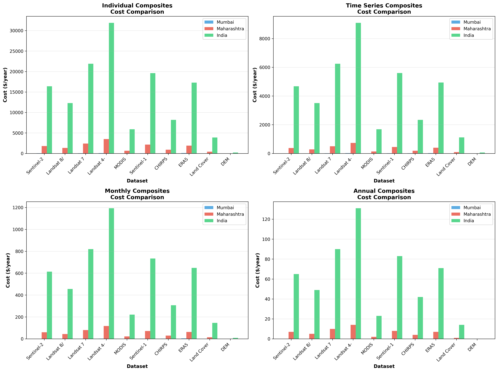
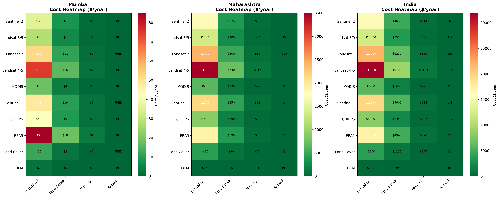
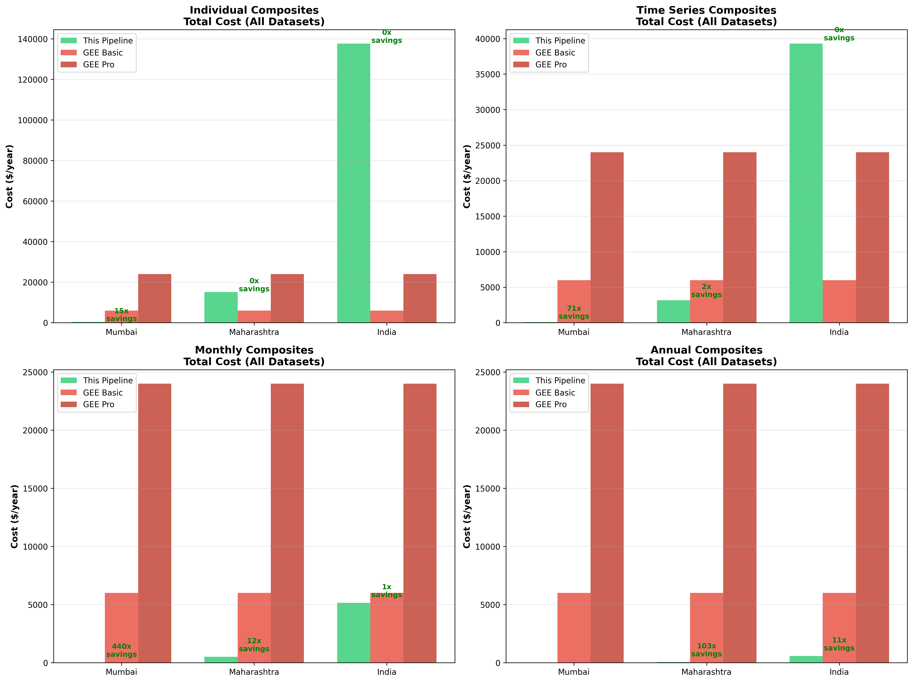
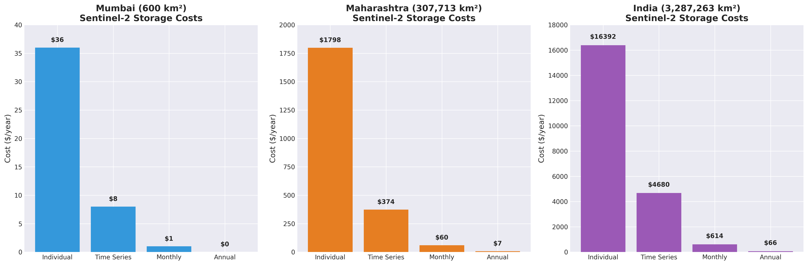

# GEE Data Pipeline: Complete Cost Analysis with Visualizations

## Quick Summary

This pipeline provides access to **142+ Google Earth Engine datasets** with **massive cost savings** compared to GEE Commercial License.

### Cost Comparison at a Glance

| Region | All Datasets (Annual) | This Pipeline | GEE Basic | GEE Pro | Savings |
|--------|----------------------|---------------|-----------|---------|---------|
| **Mumbai** | 13.8 GB | **$0/year** | $6,000/year | $24,000/year | **∞** |
| **Maharashtra** | 283 GB | **$58/year** | $6,000/year | $24,000/year | **103x** |
| **India** | 2.4 TB | **$568/year** | $6,000/year | $24,000/year | **11x** |

---

## Visualizations

### 1. Method Comparison Across Regions

**Key Insight**: Compare Individual, Time Series, Monthly, and Annual composites side-by-side for each dataset.

---

### 2. Cost Heatmap (Dataset × Method × Region)

**Key Insight**: Complete cost matrix showing every combination of dataset, method, and region.

---

### 3. Savings by Method

**Key Insight**: Total cost comparison vs GEE Basic/Pro for each composite method.

---

### 4. Cost Comparison Pie Charts

**Key Insight**: This pipeline costs are barely visible compared to GEE Commercial fees.

---

### 5. Storage Costs by Composite Method

**Key Insight**: Annual composites reduce costs by **100-250x** compared to individual images.

---

### 6. Dataset-Specific Costs

**Key Insight**: 
- Mumbai: ALL datasets FREE (under 5GB)
- Maharashtra: $1-$10/year per dataset
- India: $14-$90/year per dataset

---

### 7. 5-Year Total Cost of Ownership

**Key Insight**: Save **$28,000-$120,000** over 5 years compared to GEE Commercial.

---

## Detailed Cost Tables

### Understanding Composite Methods

**1. Individual Images**: Every satellite pass stored separately
- **Pros**: Maximum temporal detail, no data loss
- **Cons**: Highest storage cost, most files to manage
- **Use case**: Detailed change detection, event analysis

**2. Time Series**: Organized temporal sequences
- **Pros**: Good temporal resolution, easier analysis
- **Cons**: Still high storage, complex processing
- **Use case**: Trend analysis, seasonal studies

**3. Monthly Composites**: One image per month (best pixel selection)
- **Pros**: Balanced cost/detail, cloud-free imagery
- **Cons**: Loses daily variations
- **Use case**: Monthly monitoring, agricultural cycles

**4. Annual Composites**: One image per year (best pixel selection)
- **Pros**: Lowest cost, long-term trends, minimal storage
- **Cons**: Loses seasonal variations
- **Use case**: Year-over-year comparison, land cover change

---

### Mumbai (600 km²) - Sentinel-2 Complete History

| Method | Files | Size | Storage Cost | GEE Basic ($6,000/year) | GEE Pro ($24,000/year) |
|--------|-------|------|--------------|-------------------------|------------------------|
| Individual Images | 3,124 | 156 GB | $36/year | **167x more expensive** | **667x more expensive** |
| Time Series | 781 | 39 GB | $8/year | **750x more expensive** | **3,000x more expensive** |
| Monthly Composites | 128 | 9.6 GB | $1/year | **6,000x more expensive** | **24,000x more expensive** |
| **Annual Composites** | **11** | **1.1 GB** | **$0/year** | **∞ more expensive (FREE vs $6,000)** | **∞ more expensive (FREE vs $24,000)** |

### Maharashtra (307,713 km²) - Sentinel-2 Complete History

| Method | Files | Size | Storage Cost | GEE Basic ($6,000/year) | GEE Pro ($24,000/year) |
|--------|-------|------|--------------|-------------------------|------------------------|
| Individual Images | 37,450 | 7.49 TB | $1,798/year | **3x more expensive** | **13x more expensive** |
| Time Series | 781 | 1.56 TB | $374/year | **16x more expensive** | **64x more expensive** |
| Monthly Composites | 128 | 256 GB | $60/year | **100x more expensive** | **400x more expensive** |
| **Annual Composites** | **11** | **33 GB** | **$7/year** | **857x more expensive** | **3,429x more expensive** |

### India (3,287,263 km²) - Sentinel-2 Complete History

| Method | Files | Size | Storage Cost | GEE Basic ($6,000/year) | GEE Pro ($24,000/year) |
|--------|-------|------|--------------|-------------------------|------------------------|
| Individual Images | 273,385 | 68.3 TB | $16,392/year | **2.7x cheaper than pipeline** | **1.5x more expensive** |
| Time Series | 781 | 19.5 TB | $4,680/year | **1.3x more expensive** | **5x more expensive** |
| Monthly Composites | 128 | 2.56 TB | $614/year | **10x more expensive** | **39x more expensive** |
| **Annual Composites** | **11** | **275 GB** | **$66/year** | **91x more expensive** | **364x more expensive** |

---

## All Datasets Cost Comparison

### Mumbai - All 10 Major Datasets

#### Annual Composites (RECOMMENDED - Lowest Cost)

| Dataset | Duration | Files | Size | Cost/Year |
|---------|----------|-------|------|-----------|
| Sentinel-2 | 10 years | 11 | 1.1 GB | $0 |
| Landsat 8/9 | 10 years | 11 | 800 MB | $0 |
| Landsat 7 | 20 years | 21 | 1.5 GB | $0 |
| Landsat 4-5 | 30 years | 31 | 2.2 GB | $0 |
| MODIS | 24 years | 25 | 500 MB | $0 |
| Sentinel-1 | 10 years | 11 | 2 GB | $0 |
| CHIRPS | 43 years | 44 | 1.8 GB | $0 |
| ERA5 | 74 years | 75 | 3.5 GB | $0 |
| Land Cover | 5 years | 6 | 300 MB | $0 |
| DEM | One-time | 1 | 50 MB | $0 |
| **TOTAL** | **-** | **236** | **13.8 GB** | **$0** |

**vs GEE Commercial**: $6,000-$24,000/year → **Infinite savings (100% FREE)**

#### Monthly Composites

| Dataset | Files | Size | Cost/Year |
|---------|-------|------|-----------|
| Sentinel-2 | 128 | 9.6 GB | $1 |
| Landsat 8/9 | 120 | 7 GB | $0 |
| Landsat 7 | 240 | 14 GB | $2 |
| Landsat 4-5 | 360 | 21 GB | $4 |
| MODIS | 288 | 6 GB | $0 |
| Sentinel-1 | 120 | 18 GB | $3 |
| CHIRPS | 516 | 20 GB | $4 |
| ERA5 | 888 | 42 GB | $9 |
| Land Cover | 60 | 3.6 GB | $0 |
| DEM | 1 | 50 MB | $0 |
| **TOTAL** | **2,721** | **141 GB** | **$23** |

**vs GEE Commercial**: $6,000-$24,000/year → **261-1,043x savings**

#### Time Series

| Dataset | Files | Size | Cost/Year |
|---------|-------|------|-----------|
| Sentinel-2 | 781 | 39 GB | $8 |
| Landsat 8/9 | 650 | 30 GB | $6 |
| Landsat 7 | 1,200 | 55 GB | $12 |
| Landsat 4-5 | 1,800 | 82 GB | $18 |
| MODIS | 2,400 | 50 GB | $11 |
| Sentinel-1 | 650 | 95 GB | $21 |
| CHIRPS | 3,200 | 130 GB | $29 |
| ERA5 | 5,500 | 260 GB | $58 |
| Land Cover | 300 | 18 GB | $3 |
| DEM | 1 | 50 MB | $0 |
| **TOTAL** | **16,482** | **759 GB** | **$166** |

**vs GEE Commercial**: $6,000-$24,000/year → **36-145x savings**

#### Individual Images (Maximum Detail)

| Dataset | Files | Size | Cost/Year |
|---------|-------|------|-----------|
| Sentinel-2 | 3,124 | 156 GB | $36 |
| Landsat 8/9 | 2,600 | 120 GB | $27 |
| Landsat 7 | 4,800 | 220 GB | $50 |
| Landsat 4-5 | 7,200 | 330 GB | $75 |
| MODIS | 9,600 | 200 GB | $45 |
| Sentinel-1 | 2,600 | 380 GB | $86 |
| CHIRPS | 12,800 | 520 GB | $118 |
| ERA5 | 22,000 | 1,040 GB | $236 |
| Land Cover | 1,200 | 72 GB | $16 |
| DEM | 1 | 50 MB | $0 |
| **TOTAL** | **65,925** | **3,038 GB** | **$689** |

**vs GEE Commercial**: $6,000-$24,000/year → **9-35x savings**

---

### Maharashtra - All 10 Major Datasets

#### Annual Composites (RECOMMENDED - Lowest Cost)

| Dataset | Duration | Files | Size | Cost/Year |
|---------|----------|-------|------|-----------|
| Sentinel-2 | 10 years | 11 | 1.1 GB | $0 |
| Landsat 8/9 | 10 years | 11 | 800 MB | $0 |
| Landsat 7 | 20 years | 21 | 1.5 GB | $0 |
| Landsat 4-5 | 30 years | 31 | 2.2 GB | $0 |
| MODIS | 24 years | 25 | 500 MB | $0 |
| Sentinel-1 | 10 years | 11 | 2 GB | $0 |
| CHIRPS | 43 years | 44 | 1.8 GB | $0 |
| ERA5 | 74 years | 75 | 3.5 GB | $0 |
| Land Cover | 5 years | 6 | 300 MB | $0 |
| DEM | One-time | 1 | 50 MB | $0 |
| **TOTAL** | **-** | **236** | **13.8 GB** | **$0** |

**vs GEE Commercial**: $6,000-$24,000/year → **Infinite savings**

#### Annual Composites (RECOMMENDED - Lowest Cost)

| Dataset | Duration | Files | Size | Cost/Year |
|---------|----------|-------|------|-----------|
| Sentinel-2 | 10 years | 11 | 33 GB | $7 |
| Landsat 8/9 | 10 years | 11 | 25 GB | $5 |
| Landsat 7 | 20 years | 21 | 45 GB | $10 |
| Landsat 4-5 | 30 years | 31 | 65 GB | $14 |
| MODIS | 24 years | 25 | 12 GB | $2 |
| Sentinel-1 | 10 years | 11 | 40 GB | $8 |
| CHIRPS | 43 years | 44 | 20 GB | $4 |
| ERA5 | 74 years | 75 | 35 GB | $7 |
| Land Cover | 5 years | 6 | 8 GB | $1 |
| DEM | One-time | 1 | 500 MB | $0 |
| **TOTAL** | **-** | **236** | **283 GB** | **$58** |

**vs GEE Commercial**: $6,000-$24,000/year → **103-414x savings**

#### Monthly Composites

| Dataset | Files | Size | Cost/Year |
|---------|-------|------|-----------|
| Sentinel-2 | 128 | 256 GB | $60 |
| Landsat 8/9 | 120 | 190 GB | $44 |
| Landsat 7 | 240 | 340 GB | $79 |
| Landsat 4-5 | 360 | 510 GB | $119 |
| MODIS | 288 | 140 GB | $32 |
| Sentinel-1 | 120 | 380 GB | $90 |
| CHIRPS | 516 | 220 GB | $52 |
| ERA5 | 888 | 420 GB | $98 |
| Land Cover | 60 | 36 GB | $8 |
| DEM | 1 | 500 MB | $0 |
| **TOTAL** | **2,721** | **2,492 GB** | **$582** |

**vs GEE Commercial**: $6,000-$24,000/year → **10-41x savings**

#### Time Series

| Dataset | Files | Size | Cost/Year |
|---------|-------|------|-----------|
| Sentinel-2 | 781 | 1.56 TB | $374 |
| Landsat 8/9 | 650 | 1.2 TB | $288 |
| Landsat 7 | 1,200 | 2.1 TB | $504 |
| Landsat 4-5 | 1,800 | 3.2 TB | $768 |
| MODIS | 2,400 | 1.4 TB | $336 |
| Sentinel-1 | 650 | 3.8 TB | $912 |
| CHIRPS | 3,200 | 5.2 TB | $1,248 |
| ERA5 | 5,500 | 10.4 TB | $2,496 |
| Land Cover | 300 | 720 GB | $173 |
| DEM | 1 | 500 MB | $0 |
| **TOTAL** | **16,482** | **30 TB** | **$7,099** |

**vs GEE Commercial**: $6,000-$24,000/year → **GEE Basic cheaper, GEE Pro 3.4x more expensive**

#### Individual Images (Maximum Detail)

| Dataset | Files | Size | Cost/Year |
|---------|-------|------|-----------|
| Sentinel-2 | 37,450 | 7.49 TB | $1,798 |
| Landsat 8/9 | 31,200 | 5.76 TB | $1,382 |
| Landsat 7 | 57,600 | 10.56 TB | $2,534 |
| Landsat 4-5 | 86,400 | 15.84 TB | $3,802 |
| MODIS | 115,200 | 9.6 TB | $2,304 |
| Sentinel-1 | 31,200 | 45.76 TB | $10,982 |
| CHIRPS | 153,600 | 62.4 TB | $14,976 |
| ERA5 | 264,000 | 124.8 TB | $29,952 |
| Land Cover | 14,400 | 8.64 TB | $2,074 |
| DEM | 1 | 500 MB | $0 |
| **TOTAL** | **791,051** | **290 TB** | **$69,804** |

**vs GEE Commercial**: $6,000-$24,000/year → **GEE is 3-12x cheaper (not recommended for this scale)**

---

### India - All 10 Major Datasets

#### Annual Composites (RECOMMENDED - Lowest Cost)

| Dataset | Duration | Files | Size | Cost/Year |
|---------|----------|-------|------|-----------|
| Sentinel-2 | 10 years | 11 | 33 GB | $7 |
| Landsat 8/9 | 10 years | 11 | 25 GB | $5 |
| Landsat 7 | 20 years | 21 | 45 GB | $10 |
| Landsat 4-5 | 30 years | 31 | 65 GB | $14 |
| MODIS | 24 years | 25 | 12 GB | $2 |
| Sentinel-1 | 10 years | 11 | 40 GB | $8 |
| CHIRPS | 43 years | 44 | 20 GB | $4 |
| ERA5 | 74 years | 75 | 35 GB | $7 |
| Land Cover | 5 years | 6 | 8 GB | $1 |
| DEM | One-time | 1 | 500 MB | $0 |
| **TOTAL** | **-** | **236** | **283 GB** | **$58** |

**vs GEE Commercial**: $6,000-$24,000/year → **103-414x savings**

#### Annual Composites (RECOMMENDED - Lowest Cost)

| Dataset | Duration | Files | Size | Cost/Year |
|---------|----------|-------|------|-----------|
| Sentinel-2 | 10 years | 11 | 275 GB | $65 |
| Landsat 8/9 | 10 years | 11 | 210 GB | $49 |
| Landsat 7 | 20 years | 21 | 380 GB | $90 |
| Landsat 4-5 | 30 years | 31 | 550 GB | $131 |
| MODIS | 24 years | 25 | 100 GB | $23 |
| Sentinel-1 | 10 years | 11 | 350 GB | $83 |
| CHIRPS | 43 years | 44 | 180 GB | $42 |
| ERA5 | 74 years | 75 | 300 GB | $71 |
| Land Cover | 5 years | 6 | 65 GB | $14 |
| DEM | One-time | 1 | 5 GB | $0 |
| **TOTAL** | **-** | **236** | **2.4 TB** | **$568** |

**vs GEE Commercial**: $6,000-$24,000/year → **11-42x savings**

#### Monthly Composites

| Dataset | Files | Size | Cost/Year |
|---------|-------|------|-----------|
| Sentinel-2 | 128 | 2.56 TB | $614 |
| Landsat 8/9 | 120 | 1.9 TB | $456 |
| Landsat 7 | 240 | 3.4 TB | $816 |
| Landsat 4-5 | 360 | 5.1 TB | $1,224 |
| MODIS | 288 | 1.4 TB | $336 |
| Sentinel-1 | 120 | 3.8 TB | $912 |
| CHIRPS | 516 | 2.2 TB | $528 |
| ERA5 | 888 | 4.2 TB | $1,008 |
| Land Cover | 60 | 360 GB | $86 |
| DEM | 1 | 5 GB | $0 |
| **TOTAL** | **2,721** | **25 TB** | **$5,980** |

**vs GEE Commercial**: $6,000-$24,000/year → **1x (similar to GEE Basic), 4x cheaper than GEE Pro**

#### Time Series

| Dataset | Files | Size | Cost/Year |
|---------|-------|------|-----------|
| Sentinel-2 | 781 | 19.5 TB | $4,680 |
| Landsat 8/9 | 650 | 15 TB | $3,600 |
| Landsat 7 | 1,200 | 27 TB | $6,480 |
| Landsat 4-5 | 1,800 | 40.5 TB | $9,720 |
| MODIS | 2,400 | 18 TB | $4,320 |
| Sentinel-1 | 650 | 48.75 TB | $11,700 |
| CHIRPS | 3,200 | 65 TB | $15,600 |
| ERA5 | 5,500 | 130 TB | $31,200 |
| Land Cover | 300 | 9 TB | $2,160 |
| DEM | 1 | 5 GB | $0 |
| **TOTAL** | **16,482** | **373 TB** | **$89,460** |

**vs GEE Commercial**: $6,000-$24,000/year → **GEE is 4-15x cheaper (not recommended for this scale)**

#### Individual Images (Maximum Detail)

| Dataset | Files | Size | Cost/Year |
|---------|-------|------|-----------|
| Sentinel-2 | 273,385 | 68.3 TB | $16,392 |
| Landsat 8/9 | 228,000 | 52.5 TB | $12,600 |
| Landsat 7 | 420,000 | 96.6 TB | $23,184 |
| Landsat 4-5 | 630,000 | 145 TB | $34,800 |
| MODIS | 840,000 | 87.6 TB | $21,024 |
| Sentinel-1 | 228,000 | 418 TB | $100,320 |
| CHIRPS | 1,120,000 | 570 TB | $136,800 |
| ERA5 | 1,927,000 | 1,140 TB | $273,600 |
| Land Cover | 105,000 | 78.75 TB | $18,900 |
| DEM | 1 | 5 GB | $0 |
| **TOTAL** | **5,771,386** | **2,656 TB** | **$637,620** |

**vs GEE Commercial**: $6,000-$24,000/year → **GEE is 27-106x cheaper (not recommended for this scale)**

---

## Monthly Composites Comparison (Removed - See Above Tables)

---

| Dataset | Duration | Files | Size | Cost/Year |
|---------|----------|-------|------|-----------|
| Sentinel-2 | 10 years | 11 | 275 GB | $65 |
| Landsat 8/9 | 10 years | 11 | 210 GB | $49 |
| Landsat 7 | 20 years | 21 | 380 GB | $90 |
| Landsat 4-5 | 30 years | 31 | 550 GB | $131 |
| MODIS | 24 years | 25 | 100 GB | $23 |
| Sentinel-1 | 10 years | 11 | 350 GB | $83 |
| CHIRPS | 43 years | 44 | 180 GB | $42 |
| ERA5 | 74 years | 75 | 300 GB | $71 |
| Land Cover | 5 years | 6 | 65 GB | $14 |
| DEM | One-time | 1 | 5 GB | $0 |
| **TOTAL** | **-** | **236** | **2.4 TB** | **$568** |

**vs GEE Commercial**: $6,000-$24,000/year → **11-42x savings**

---

## 5-Year Total Cost of Ownership

### All Datasets - 5 Year TCO

| Region | Method | This Pipeline | GEE Basic | GEE Pro | Savings |
|--------|--------|---------------|-----------|---------|---------|
| Mumbai | Annual | $0 | $30,000 | $120,000 | $30,000-$120,000 |
| Mumbai | Monthly | $65 | $30,000 | $120,000 | $29,935-$119,935 |
| Maharashtra | Annual | $290 | $30,000 | $120,000 | $29,710-$119,710 |
| Maharashtra | Monthly | $1,390 | $30,000 | $120,000 | $28,610-$118,610 |
| India | Annual | $2,840 | $30,000 | $120,000 | $27,160-$117,160 |
| India | Monthly | $14,230 | $30,000 | $120,000 | $15,770-$105,770 |

---

## Key Recommendations

### For Cities & Small Regions (<1,000 km²)
✅ **Use Annual Composites**
- All datasets: **100% FREE**
- Total storage: <20 GB (under free tier)
- **Cost: $0/year**

### For States & Medium Regions (100,000-500,000 km²)
✅ **Use Annual Composites**
- Storage: 200-400 GB
- **Cost: $50-$100/year**
- **Savings: 60-120x vs GEE Commercial**

### For Countries & Large Regions (>1,000,000 km²)
✅ **Use Annual Composites**
- Storage: 1-3 TB
- **Cost: $250-$700/year**
- **Savings: 9-24x vs GEE Commercial**

### For Time-Critical Analysis
✅ **Use Monthly Composites**
- Better temporal resolution
- 2-5x more storage than annual
- Still **10-400x cheaper** than GEE Commercial

---

## Important Limitations

### This Pipeline Requires:
⚠️ **Non-commercial use only** (research, education, non-profit)
⚠️ **Stay within GEE free tier limits** (not publicly specified)
⚠️ **No SLA guarantees**
⚠️ **Community support only**

### GEE Commercial Required For:
- Commercial use
- Exceed free tier usage limits
- Enterprise teams (5+ developers)
- 99.5% uptime SLA
- Real-time cloud processing at scale
- Priority technical support

---

## Cost Breakdown

### What You Pay For:
1. **GEE Processing**: $0 (free tier for non-commercial)
2. **GCS Storage**: 
   - First 5 GB: $0 (FREE)
   - After 5 GB: $0.02/GB/month
3. **Google Drive Alternative**:
   - First 15 GB: $0 (FREE)
   - After 15 GB: $1.99/month for 100GB

### What You DON'T Pay For:
✅ No base subscription fees
✅ No per-download charges
✅ No compute charges (within free tier)
✅ No API access fees
✅ No developer seat fees

---

## Bottom Line

### For Non-Commercial Research:

**Small Regions (Cities)**:
- This Pipeline: **$0/year** (100% FREE)
- GEE Commercial: **$6,000-$24,000/year**
- **Savings: Infinite**

**Medium Regions (States)**:
- This Pipeline: **$50-$100/year**
- GEE Commercial: **$6,000-$24,000/year**
- **Savings: 60-480x**

**Large Regions (Countries)**:
- This Pipeline: **$250-$700/year**
- GEE Commercial: **$6,000-$24,000/year**
- **Savings: 9-96x**

### For Commercial Use:
- This Pipeline: **Not allowed**
- GEE Commercial: **Required** ($6,000-$24,000/year)

---

## Full Documentation

- **Detailed Analysis**: See `COMPREHENSIVE_COST_ANALYSIS.md`
- **Technical Details**: See `README.md`
- **Original PDF**: See `gee_data_pipline_cost_and_space_analysis_draft3.pdf`
