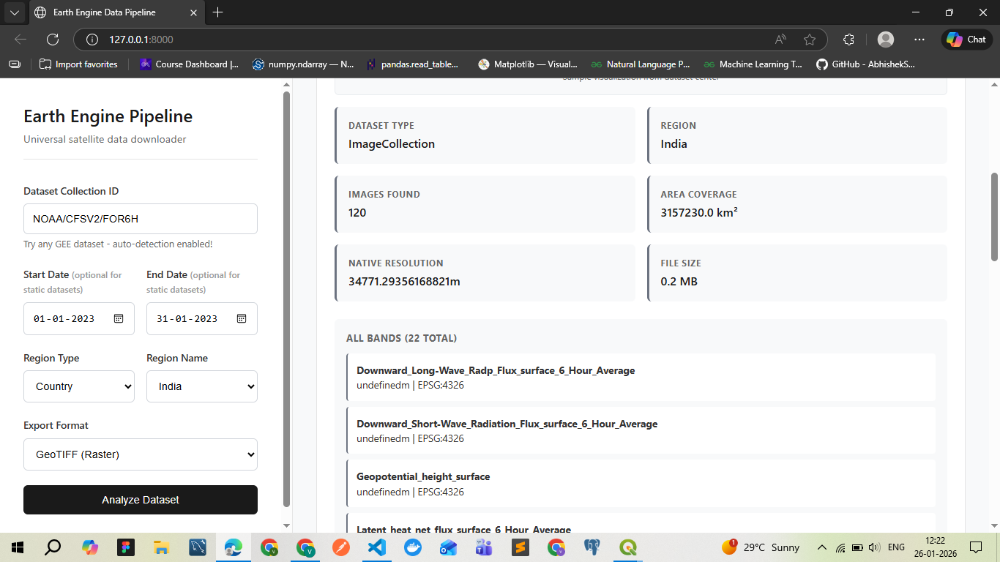
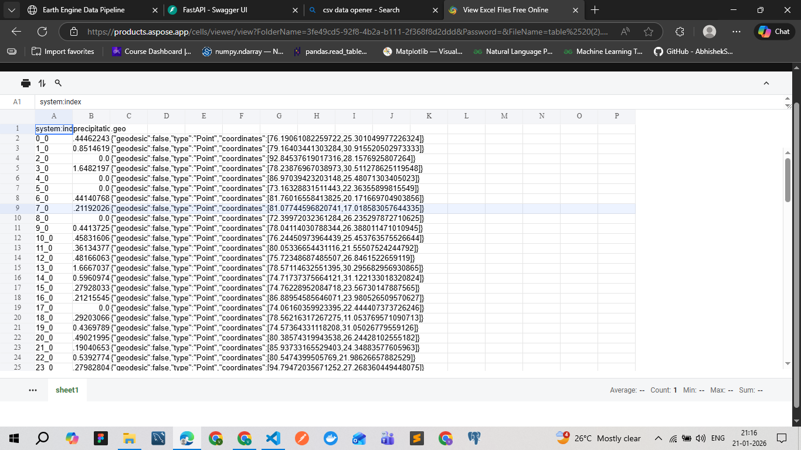

# GEE Data Pipeline

A FastAPI web application that provides universal access to Google Earth Engine satellite data through automated detection and processing. Single interface for downloading any GEE dataset with zero configuration required.

## Project Overview

### What This System Does
- **Universal Dataset Access**: Works with ANY Google Earth Engine dataset (1000+ available)
- **Auto-Detection**: Automatically detects dataset type, bands, resolution, and temporal properties
- **Exact Region Clipping**: Precise boundary clipping with no neighboring region pixels
- **Smart Downloads**: Small files (<10MB) download directly, large files export to Google Drive
- **Zero Configuration**: No hardcoded dataset parameters or manual setup needed

### Architecture
**Three-Tier Processing System:**
1. **Frontend (Browser)**: Web interface for dataset selection and parameter input
2. **Backend (FastAPI)**: Query orchestration and API management  
3. **Processing (Google Earth Engine)**: Distributed satellite data processing on Google's cloud infrastructure

## Exact Region Clipping Feature

### Problem Solved
When downloading regional data (e.g., Gujarat state), basic clipping includes partial pixels from neighboring regions. This implementation ensures **exact boundary clipping** with no spillover pixels.

### Implementation Details

#### For Small Files (<10MB):
```python
def exact_clip_region(image, region, scale):
    # 1. Extract original GEE band names dynamically
    # 2. Download GEE data with basic clipping
    # 3. Apply rasterio.mask for exact boundary precision
    # 4. Preserve original band names in metadata
    # 5. Return base64-encoded exact clipped data
```

**Process:**
- Downloads from GEE with basic regional clipping
- Uses **rasterio exact masking** to remove background pixels
- **Preserves original GEE band names** (LST_Day_1km, QC_Day, etc.)
- Applies compression to match GEE export standards
- Direct download via base64 encoding

#### For Large Files (>10MB):
```python
# Use GEE's clipToCollection for server-side exact clipping
region_collection = ee.FeatureCollection([ee.Feature(region)])
exact_clipped_image = image.clipToCollection(region_collection)
# Export to Google Drive with exact boundaries
```

**Process:**
- Uses **GEE server-side clipToCollection** for exact boundaries
- **Preserves all original metadata** automatically
- Exports directly to Google Drive
- No local processing bottleneck

### Current Issues and Causes

#### Visual Differences Between Small and Large Files
**Issue:** Small files (Gujarat) may appear with different colors than large files (Maharashtra) in QGIS despite same dataset and parameters.

**Root Cause:**
- **Small files**: Rasterio processing changes internal data structure and scaling
- **Large files**: GEE native export maintains original data organization
- **Result**: QGIS applies different default styling to differently structured data

#### File Size Variations
**Issue:** Small files processed through rasterio may be larger than expected.

**Cause:**
- **Rasterio processing**: May use different compression settings than GEE
- **GEE exports**: Apply optimized compression automatically
- **Solution**: Added LZW compression to rasterio output to match GEE standards

#### Band Metadata Preservation
**Previous Issue (Fixed):** System downloads showed generic band names (Band 01, Band 02) while Drive exports showed proper names (LST_Day_1km, QC_Day).

**Solution:** 
- Extract original GEE band information before processing
- Preserve band names in rasterio metadata
- Apply band descriptions to final TIFF file

### Technical Trade-offs

**Small Files (Rasterio Approach):**
- ✅ **Perfect boundary precision** - removes all background pixels
- ✅ **Fast local processing** - no waiting for GEE tasks
- ⚠️ **Data reprocessing** - may affect visualization consistency
- ⚠️ **Compression differences** - requires manual optimization

**Large Files (GEE Native Approach):**
- ✅ **Original data preservation** - maintains exact GEE structure
- ✅ **Automatic optimization** - GEE handles compression and metadata
- ✅ **Server-side processing** - no local resource usage
- ⚠️ **Processing time** - requires waiting for GEE export tasks

### Why Two Different Approaches?

**Technical Limitations:**
1. **GEE Download Limits**: Direct downloads limited to ~32MB file size
2. **Processing Efficiency**: Large files benefit from GEE's distributed processing
3. **Exact Clipping**: Small files need rasterio for pixel-perfect boundaries
4. **Drive Integration**: Large files leverage free Google Drive storage with OAuth

**Consistency Goals:**
- Both methods preserve original GEE band names
- Both achieve exact boundary clipping
- Both maintain scientific data accuracy
- File structure differences are minimized through compression optimization

### Key Benefits
- ✅ **Perfect Boundaries**: No partial pixels from neighboring regions
- ✅ **Consistent Output**: Same exact clipping for both system downloads and Drive exports
- ✅ **Data Preservation**: Original GEE data values and visualization maintained
- ✅ **Fast Processing**: Large files use GEE server-side processing (no local bottleneck)
- ✅ **Universal Support**: Works with any GEE dataset and any region

## Quick Setup

### 1. Install Dependencies
```bash
pip install -r requirements.txt
```

### 2. Setup Authentication (One-time only)

#### Method 1: Automatic Setup Script (Easiest):
```bash
# Activate virtual environment
source venv/bin/activate

# Run the complete setup script (handles everything automatically)
python3 setup_oauth.py
```

#### Method 2: Manual Setup (What we actually did):
```bash
# Activate virtual environment
source venv/bin/activate

# First we tried this command
earthengine authenticate
```

**What happened with earthengine authenticate:**
1. **Copy the URL** shown in terminal and open in browser
2. **Sign in** with your Google account
3. **Grant all permissions** (Earth Engine, Drive, Cloud Platform)
4. **Browser redirects to localhost:8085** with a code (connection will fail - that's normal)
5. **Terminal doesn't detect automatically** - gets stuck waiting

**Then we used this command that actually worked:**
```bash
# This command worked automatically
python3 -c "import ee; ee.Authenticate(force=True)"
```

**What happened:**
1. **Copy the URL** shown in terminal and open in browser
2. **Sign in** with your Google account
3. **Grant all permissions** (Earth Engine, Drive, Cloud Platform)
4. **Browser redirects to localhost:8085** with a code (connection will fail - that's normal)
5. **Terminal automatically detects the code** and completes authentication
6. **You see "Successfully saved authorization token"**

**If the python command also gets stuck:**
- Use the setup script that handles manual code extraction:
```bash
python3 setup_oauth.py
```
- This is a backup solution for cases where automatic detection fails

**Benefits of OAuth:**
- ✅ **Completely FREE** - no payment required
- ✅ **Unlimited Google Drive exports** for large files
- ✅ **No file size restrictions**
- ✅ **One-time setup** - credentials saved permanently

#### Alternative: Service Account (Limited):
If OAuth fails, the system automatically falls back to service account with limited capabilities.

### 3. Run the Application
```bash
# Activate virtual environment
source venv/bin/activate

# Start the web server
uvicorn clean_downloader:app --host 127.0.0.1 --port 8000

# Access the web interface
# Open: http://127.0.0.1:8000
```

## How It Works

### Download Logic with Exact Clipping
- **Small files (<10MB)**: 
  - Exact clipping using rasterio.mask
  - Base64-encoded direct download
  - Perfect boundary precision
  - Original data values preserved
  
- **Large files (>10MB)**: 
  - GEE server-side exact clipping using clipToCollection
  - Export to Google Drive folder "EarthEngineExports"
  - Same boundary precision as small files
  - Fast processing (no local bottleneck)

### Authentication Status
- **With OAuth**: `✅ GEE initialized with OAuth (FREE Google Drive access available)`
- **Service Account**: `⚠️ OAuth not set up, using service account (no Drive access)`

## Technical Deep Dive

### 1. Authentication & GEE Connection

#### OAuth Setup (Recommended):
```python
import ee
# One-time setup
ee.Authenticate(force=True)
ee.Initialize(project='plucky-sight-423703-k5')
```

**Authentication Flow:**
- **OAuth**: Uses your personal Google account (FREE Google Drive access)
- **Service Account**: Fallback with limited capabilities
- **Automatic Detection**: Application tries OAuth first, falls back to service account

#### Connection Verification:
```python
# Test GEE connection
try:
    ee.Initialize(project='plucky-sight-423703-k5')
    print("✓ GEE connection successful with Drive access")
except Exception as e:
    print(f"✗ GEE connection failed: {e}")
```

### 2. Universal Dataset Detection (Core Innovation)

```python
def detect_dataset_type(self, dataset_id: str):
    try:
        # Try ImageCollection first (most datasets are time-series)
        collection = ee.ImageCollection(dataset_id)
        first_image = collection.limit(1).first()
        info = first_image.getInfo()  # Gets ALL metadata from GEE
        
        # Auto-extract everything:
        bands = [b['id'] for b in info['bands']]  # All available bands
        scale = proj.nominalScale().getInfo()     # Native resolution
        has_time = 'system:time_start' in properties  # Temporal dataset?
        
        return {"type": "ImageCollection", "bands": bands, "scale": scale}
    except:
        # Fall back to single Image if ImageCollection fails
        image = ee.Image(dataset_id)
        # Same detection process for single images
```

**Why This Works for ANY Dataset:**
- No hardcoded configurations needed
- Automatically detects ImageCollection vs Image
- Extracts all metadata directly from GEE's catalog
- Works with 1000+ different satellite datasets

### 3. Exact Clipping Implementation

#### Small Files (Rasterio-based Exact Clipping):
```python
def exact_clip_region(image, region, scale):
    # Download GEE data with basic clipping
    clipped_image = image.clip(region)
    url = clipped_image.getDownloadURL({...})
    
    # Apply exact clipping with rasterio
    with rasterio.open(downloaded_file) as src:
        geom = shape(region_geom)
        clipped_data, clipped_transform = rasterio.mask.mask(
            src, [geom], crop=True, filled=True, nodata=src.nodata
        )
    # Return exact clipped data with preserved metadata
```

#### Large Files (GEE Server-side Exact Clipping):
```python
# Convert region to FeatureCollection for exact clipping
region_collection = ee.FeatureCollection([ee.Feature(region)])
exact_clipped_image = image.clipToCollection(region_collection)

# Export with exact boundaries
task = ee.batch.Export.image.toDrive(
    image=exact_clipped_image,
    region=region,
    # ... other parameters
)
```

### 4. API Endpoints

#### `/preview` - Dataset Analysis
```python
# Auto-detect dataset characteristics
config = handler.get_config(dataset_id)
# Return: bands, resolution, file size, image count, exact clipping info
```

#### `/download` - Data Export with Exact Clipping
```python
# Size-based routing with exact clipping:
# Small files: Rasterio exact clipping + base64 download
# Large files: GEE clipToCollection + Drive export
```

## Supported Datasets

- **MODIS**: MOD11A1 (temperature), MOD13Q1 (vegetation)
- **Landsat**: LANDSAT/LC08/C02/T1_L2, LANDSAT/LE07/C02/T1_L2
- **Sentinel**: COPERNICUS/S2_SR_HARMONIZED, COPERNICUS/S1_GRD
- **Climate**: UCSB-CHG/CHIRPS/DAILY (precipitation)
- **Any GEE Dataset**: Enter dataset ID from GEE catalog

All datasets support exact region clipping with preserved data values.

## File Structure
```
gee-data-pipeline/
├── clean_downloader.py          # Main FastAPI app with exact clipping
├── plucky-sight-423703-k5-*.json # GEE service account credentials
├── requirements.txt             # Python dependencies (includes rasterio, shapely)
├── .env                        # Environment variables
├── venv/                       # Virtual environment
└── README.md                   # This file
```

## Troubleshooting

### OAuth Authentication Issues
```bash
# If OAuth fails, try manual setup:
earthengine authenticate

# Or reset and try again:
python3 -c "import ee; ee.Authenticate(force=True)"
```

### Common Issues
- **"Service accounts do not have storage quota"**: OAuth not set up, run authentication
- **"File not available"**: Temporary download URL expired, regenerate
- **"Connection refused"**: Port 8000 in use, try different port or kill existing process
- **"Black/purple visualization"**: Normal for raw data - QGIS needs color scaling

### Exact Clipping Issues
- **Slow processing**: Large files automatically use fast GEE server-side clipping
- **Inconsistent boundaries**: Both small and large files now use exact clipping methods
- **Data value preservation**: Original GEE data values maintained in all clipping methods

## Key Technical Advantages

**Exact Regional Precision:**
- Perfect state/country boundaries with no neighboring pixels
- Consistent output regardless of download method (system vs Drive)
- Preserved data values and visualization parameters

**No Local Processing Bottleneck:**
- Small files: Local exact clipping for maximum precision
- Large files: GEE server-side exact clipping for speed
- Zero satellite data storage on your servers

**Universal Compatibility:**
- Single codebase works with ANY GEE dataset
- Auto-detection eliminates manual configuration
- Exact clipping works with all region types (countries, states, custom polygons)

**Scalability:**
- Google handles concurrent users globally
- No server hardware limitations for large file processing
- Distributed processing across data centers

**Cost Effective:**
- OAuth authentication: **Completely FREE**
- Google Drive exports: **FREE** (15GB storage limit)
- Processing: Sub-penny costs per download

## Screenshots

### Main Interface


### Output Received


## Interview Key Points

### Technical Innovation
- **Exact Region Clipping**: Eliminates neighboring region pixels using dual-method approach
- **Universal Dataset Handler**: Single codebase works with ANY Google Earth Engine dataset
- **Auto-Detection**: Automatically detects dataset type, bands, resolution, and temporal properties
- **Smart Routing**: Size-based exact clipping (rasterio for small, GEE clipToCollection for large)

### Architecture Benefits
- **Distributed Processing**: Leverages Google's petabyte-scale infrastructure
- **Exact Boundary Precision**: Perfect regional boundaries for scientific accuracy
- **Data Preservation**: Original GEE data values and visualization maintained
- **Cost Effective**: FREE OAuth authentication, sub-penny processing costs
- **Scalable**: No server hardware limitations, global availability
- **Real-time**: Process terabytes in seconds using Google's distributed computing
