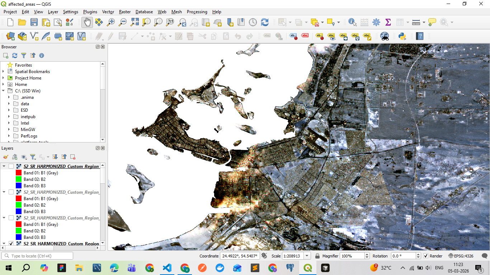
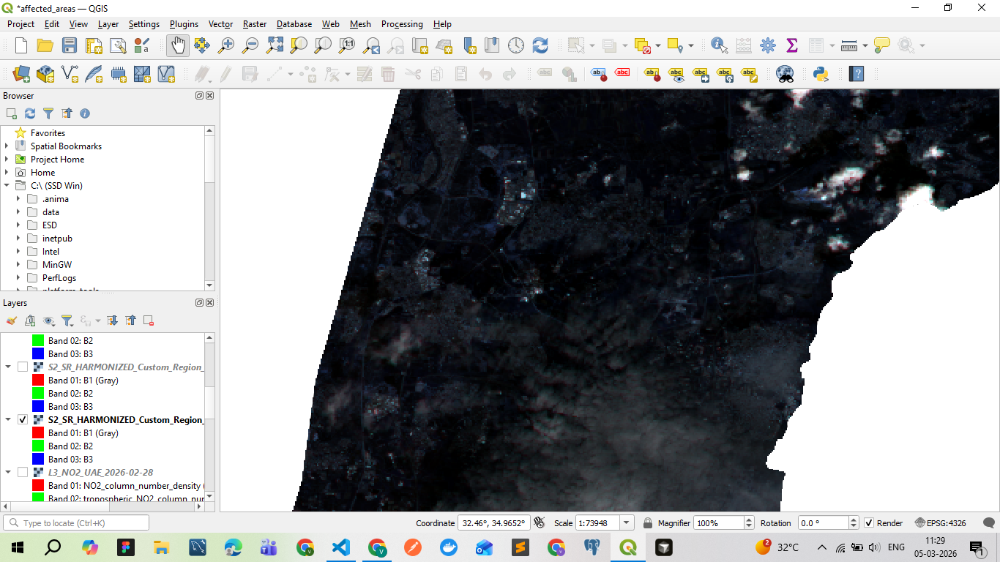

### Output Received


### Output Received


# GEE Data Pipeline

A FastAPI web application that provides universal access to Google Earth Engine satellite data through automated detection and processing. Single interface for downloading any GEE dataset with zero configuration required.

## Project Overview

### What This System Does
- **Universal Dataset Access**: Works with ANY Google Earth Engine dataset (1000+ available)
- **Auto-Detection**: Automatically detects dataset type, bands, resolution, and temporal properties
- **Exact Region Clipping**: Precise boundary clipping with no neighboring region pixels
- **Smart Downloads**: Small files (<10MB) download directly, large files export to Google Drive
- **Zero Configuration**: No hardcoded dataset parameters or manual setup needed

### Architecture
**Three-Tier Processing System:**
1. **Frontend (Browser)**: Web interface for dataset selection and parameter input
2. **Backend (FastAPI)**: Query orchestration and API management  
3. **Processing (Google Earth Engine)**: Distributed satellite data processing on Google's cloud infrastructure

## Exact Region Clipping Feature

### Problem Solved
When downloading regional data (e.g., Gujarat state), basic clipping includes partial pixels from neighboring regions. This implementation ensures **exact boundary clipping** with no spillover pixels.

### Implementation Details

#### Unified Clipping Approach
All exports (system, Drive, GCS) use **GEE's server-side `clipToCollection`** for exact boundary precision:

```python
# Convert region to FeatureCollection for exact clipping
region_collection = ee.FeatureCollection([ee.Feature(region)])
exact_clipped_image = image.clipToCollection(region_collection)
```

#### Export Routing Based on File Size

**File Size Estimation:**
```python
# Calculate with compression factor
uncompressed_mb = (pixels * bands * 4) / (1024 * 1024)
estimated_mb = uncompressed_mb / 3  # GeoTIFF LZW compression (~3x)
```

**Auto-Routing Logic:**
- **Small files (estimated <5MB)**: Direct system download with rasterio exact clipping
- **Large files (estimated >5MB)**: Google Drive export with GEE server-side clipping
- **Optional**: GCS bucket export available for any file size

**Note:** Actual file sizes vary due to compression (typically 2-5x smaller than uncompressed). Example: Gujarat estimated ~3MB, actual ~10MB.

#### For Small Files (<5MB estimated):
```python
def exact_clip_region(image, region, scale):
    # 1. Download from GEE with basic clipping
    # 2. Apply rasterio.mask for exact boundary precision
    # 3. Preserve original GEE band names in metadata
    # 4. Apply LZW compression
    # 5. Return base64-encoded exact clipped data
```

**Process:**
- Downloads from GEE with basic regional clipping
- Uses **rasterio exact masking** to remove background pixels
- **Preserves original GEE band names** (LST_Day_1km, QC_Day, etc.)
- Applies LZW compression to match GEE export standards
- Direct download via base64 encoding

#### For Large Files (>5MB estimated):
```python
# Use GEE's clipToCollection for server-side exact clipping
region_collection = ee.FeatureCollection([ee.Feature(region)])
exact_clipped_image = image.clipToCollection(region_collection)
# Export to Google Drive with exact boundaries
```

**Process:**
- Uses **GEE server-side clipToCollection** for exact boundaries
- **Preserves all original metadata** automatically
- Exports directly to Google Drive
- No local processing bottleneck

### File Size Examples

| Region | Estimated Size | Actual Size | Export Method |
|--------|---------------|-------------|---------------|
| Gujarat | ~3 MB | ~10 MB | System Download |
| Maharashtra | ~6 MB | ~19 MB | Google Drive |
| Small districts | ~1 MB | ~3-5 MB | System Download |

**Why the difference?**
- Estimation uses 3x compression factor (conservative)
- Actual compression varies by dataset (2-5x typical)
- Temperature data compresses better than optical imagery
- Homogeneous regions compress more than heterogeneous

### Key Benefits
- ✅ **Perfect Boundaries**: No partial pixels from neighboring regions
- ✅ **Consistent Clipping**: Same exact method for all export types
- ✅ **Smart Routing**: Auto-selects best export method by size
- ✅ **Data Preservation**: Original GEE data values and band names maintained
- ✅ **Fast Processing**: Large files use GEE server-side processing
- ✅ **Universal Support**: Works with any GEE dataset and any region

## Quick Setup

### 1. Install Dependencies
```bash
pip install -r requirements.txt
```

### 2. Setup Authentication (One-time only)

#### Method 1: Automatic Setup Script (Easiest):
```bash
# Activate virtual environment
source venv/bin/activate

# Run the complete setup script (handles everything automatically)
python3 setup_oauth.py
```

#### Method 2: Manual Setup (What we actually did):
```bash
# Activate virtual environment
source venv/bin/activate

# First we tried this command
earthengine authenticate
```

**What happened with earthengine authenticate:**
1. **Copy the URL** shown in terminal and open in browser
2. **Sign in** with your Google account
3. **Grant all permissions** (Earth Engine, Drive, Cloud Platform)
4. **Browser redirects to localhost:8085** with a code (connection will fail - that's normal)
5. **Terminal doesn't detect automatically** - gets stuck waiting

**Then we used this command that actually worked:**
```bash
# This command worked automatically
python3 -c "import ee; ee.Authenticate(force=True)"
```

**What happened:**
1. **Copy the URL** shown in terminal and open in browser
2. **Sign in** with your Google account
3. **Grant all permissions** (Earth Engine, Drive, Cloud Platform)
4. **Browser redirects to localhost:8085** with a code (connection will fail - that's normal)
5. **Terminal automatically detects the code** and completes authentication
6. **You see "Successfully saved authorization token"**

**If the python command also gets stuck:**
- Use the setup script that handles manual code extraction:
```bash
python3 setup_oauth.py
```
- This is a backup solution for cases where automatic detection fails

**Benefits of OAuth:**
- ✅ **Completely FREE** - no payment required
- ✅ **Unlimited Google Drive exports** for large files
- ✅ **No file size restrictions**
- ✅ **One-time setup** - credentials saved permanently

#### Alternative: Service Account (Limited):
If OAuth fails, the system automatically falls back to service account with limited capabilities.

### 3. Run the Application
```bash
# Activate virtual environment
source venv/bin/activate

# Start the web server
uvicorn clean_downloader:app --host 127.0.0.1 --port 8000

# Access the web interface
# Open: http://127.0.0.1:8000
```

## How It Works

### Download Logic with Exact Clipping
- **Small files (<5MB estimated)**: 
  - Exact clipping using rasterio.mask
  - Base64-encoded direct download
  - Perfect boundary precision
  - Original data values preserved
  
- **Large files (>5MB estimated)**: 
  - GEE server-side exact clipping using clipToCollection
  - Export to Google Drive folder "EarthEngineExports"
  - Same boundary precision as small files
  - Fast processing (no local bottleneck)

- **Optional GCS Export**:
  - Available for any file size
  - Export to Google Cloud Storage bucket
  - Default bucket: `gee-exports-free`

### Authentication Status
- **With OAuth**: `✅ GEE initialized with OAuth (FREE Google Drive access available)`
- **Service Account**: `⚠️ OAuth not set up, using service account (no Drive access)`

## Technical Deep Dive

### 1. Authentication & GEE Connection

#### OAuth Setup (Recommended):
```python
import ee
# One-time setup
ee.Authenticate(force=True)
ee.Initialize(project='plucky-sight-423703-k5')
```

**Authentication Flow:**
- **OAuth**: Uses your personal Google account (FREE Google Drive access)
- **Service Account**: Fallback with limited capabilities
- **Automatic Detection**: Application tries OAuth first, falls back to service account

#### Connection Verification:
```python
# Test GEE connection
try:
    ee.Initialize(project='plucky-sight-423703-k5')
    print("✓ GEE connection successful with Drive access")
except Exception as e:
    print(f"✗ GEE connection failed: {e}")
```

### 2. Universal Dataset Detection (Core Innovation)

```python
def detect_dataset_type(self, dataset_id: str):
    try:
        # Try ImageCollection first (most datasets are time-series)
        collection = ee.ImageCollection(dataset_id)
        first_image = collection.limit(1).first()
        info = first_image.getInfo()  # Gets ALL metadata from GEE
        
        # Auto-extract everything:
        bands = [b['id'] for b in info['bands']]  # All available bands
        scale = proj.nominalScale().getInfo()     # Native resolution
        has_time = 'system:time_start' in properties  # Temporal dataset?
        
        return {"type": "ImageCollection", "bands": bands, "scale": scale}
    except:
        # Fall back to single Image if ImageCollection fails
        image = ee.Image(dataset_id)
        # Same detection process for single images
```

**Why This Works for ANY Dataset:**
- No hardcoded configurations needed
- Automatically detects ImageCollection vs Image
- Extracts all metadata directly from GEE's catalog
- Works with 1000+ different satellite datasets

### 3. Exact Clipping Implementation

#### Small Files (Rasterio-based Exact Clipping):
```python
def exact_clip_region(image, region, scale):
    # Download GEE data with basic clipping
    clipped_image = image.clip(region)
    url = clipped_image.getDownloadURL({...})
    
    # Apply exact clipping with rasterio
    with rasterio.open(downloaded_file) as src:
        geom = shape(region_geom)
        clipped_data, clipped_transform = rasterio.mask.mask(
            src, [geom], crop=True, filled=True, nodata=src.nodata
        )
    # Return exact clipped data with preserved metadata
```

#### Large Files (GEE Server-side Exact Clipping):
```python
# Convert region to FeatureCollection for exact clipping
region_collection = ee.FeatureCollection([ee.Feature(region)])
exact_clipped_image = image.clipToCollection(region_collection)

# Export with exact boundaries
task = ee.batch.Export.image.toDrive(
    image=exact_clipped_image,
    region=region,
    # ... other parameters
)
```

### 4. API Endpoints

#### `/preview` - Dataset Analysis
```python
# Auto-detect dataset characteristics
config = handler.get_config(dataset_id)
# Return: bands, resolution, file size, image count, exact clipping info
```

#### `/download` - Data Export with Exact Clipping
```python
# Size-based routing with exact clipping:
# Small files (<5MB estimated): Rasterio exact clipping + base64 download
# Large files (>5MB estimated): GEE clipToCollection + Drive export
# Optional: GCS export for any file size
```

## Supported Datasets

- **MODIS**: MOD11A1 (temperature), MOD13Q1 (vegetation)
- **Landsat**: LANDSAT/LC08/C02/T1_L2, LANDSAT/LE07/C02/T1_L2
- **Sentinel**: COPERNICUS/S2_SR_HARMONIZED, COPERNICUS/S1_GRD
- **Climate**: UCSB-CHG/CHIRPS/DAILY (precipitation)
- **Any GEE Dataset**: Enter dataset ID from GEE catalog

All datasets support exact region clipping with preserved data values.

## File Structure
```
gee-data-pipeline/
├── clean_downloader.py          # Main FastAPI app with exact clipping
├── plucky-sight-423703-k5-*.json # GEE service account credentials
├── requirements.txt             # Python dependencies (includes rasterio, shapely)
├── .env                        # Environment variables
├── venv/                       # Virtual environment
└── README.md                   # This file
```

## Troubleshooting

### OAuth Authentication Issues
```bash
# If OAuth fails, try manual setup:
earthengine authenticate

# Or reset and try again:
python3 -c "import ee; ee.Authenticate(force=True)"
```

### Common Issues
- **"Service accounts do not have storage quota"**: OAuth not set up, run authentication
- **"File not available"**: Temporary download URL expired, regenerate
- **"Connection refused"**: Port 8000 in use, try different port or kill existing process
- **"Black/purple visualization"**: Normal for raw data - QGIS needs color scaling

### Multiple File Exports (Fixed)
**Issue:** Large exports (Sentinel-2) created multiple tile files instead of one
**Solution:** Added `shardSize=256` and `cloudOptimized: True` to force single-file exports
**Result:** Now creates 1 single cloud-optimized GeoTIFF file

### Slow Sentinel-2 Exports
**Issue:** State/country exports take 30-60 minutes and create large files (2-4 GB)
**Solution:** Use **City** region option instead
**Result:** 2-5 minute exports, 50-200 MB files, single file output

### City Region Selection
Added city option for faster, smaller exports:
- **30 cities supported** (20 Indian + 10 US cities)
- **20km radius** around city center
- **Perfect for Sentinel-2** high-resolution data
- **250x smaller area** than states = much faster

Supported cities: Mumbai, Delhi, Bangalore, Hyderabad, Chennai, Kolkata, Pune, Ahmedabad, Surat, Jaipur, Lucknow, Kanpur, Nagpur, Indore, Bhopal, Visakhapatnam, Patna, Vadodara, Ludhiana, Agra, New York, Los Angeles, Chicago, Houston, Phoenix, Philadelphia, San Antonio, San Diego, Dallas, San Jose

### Exact Clipping Issues
- **Slow processing**: Large files automatically use fast GEE server-side clipping
- **Inconsistent boundaries**: Both small and large files now use exact clipping methods
- **Data value preservation**: Original GEE data values maintained in all clipping methods

## Cost Analysis

### 💰 100% FREE for Typical Usage

**Google Earth Engine:**
- ✅ FREE for research, education, and non-profit use
- ✅ FREE for commercial use up to certain limits
- Processing: Sub-penny costs (covered by Google's free tier)

**Google Drive Exports:**
- ✅ FREE - 15GB storage included with Google account
- No charges as long as you stay under 15GB

**Google Cloud Storage (GCS):**
- ✅ FREE tier: 5GB storage per month
- ✅ FREE tier: 5,000 Class A operations per month
- Only pay if you exceed free tier limits

**OAuth Authentication:**
- ✅ Completely FREE - no payment required
- Just uses your Google account credentials

**This Application:**
- ✅ FREE - runs locally on your machine
- No server costs, no subscription fees

### When You Would Pay

You'd only pay if:
1. **Drive storage > 15GB** → Need Google One subscription ($1.99/month for 100GB)
2. **GCS storage > 5GB/month** → Pay for excess storage (~$0.02/GB/month)
3. **Commercial GEE use at scale** → Contact Google for enterprise pricing

### Stay FREE by:
- Delete old exports after downloading them locally
- Use GCS for temporary storage (auto-delete after 30 days)
- Keep Drive usage under 15GB
- Use City regions for smaller file sizes

## Key Technical Advantages

**Exact Regional Precision:**
- Perfect state/country boundaries with no neighboring pixels
- Consistent output regardless of download method (system vs Drive)
- Preserved data values and visualization parameters

**Smart File Size Routing:**
- Estimates compressed size using 3x compression factor
- Small files (<5MB estimated): Local exact clipping for maximum precision
- Large files (>5MB estimated): GEE server-side exact clipping for speed
- Actual sizes vary 2-5x due to compression (e.g., Gujarat: ~3MB estimated, ~10MB actual)

**No Local Processing Bottleneck:**
- Small files: Local exact clipping for maximum precision
- Large files: GEE server-side exact clipping for speed
- Zero satellite data storage on your servers

**Universal Compatibility:**
- Single codebase works with ANY GEE dataset
- Auto-detection eliminates manual configuration
- Exact clipping works with all region types (countries, states, custom polygons)

**Scalability:**
- Google handles concurrent users globally
- No server hardware limitations for large file processing
- Distributed processing across data centers

**Cost Effective:**
- OAuth authentication: **Completely FREE**
- Google Drive exports: **FREE** (15GB storage limit)
- GCS exports: **FREE tier** (5GB storage)
- Processing: Sub-penny costs per download

## Screenshots

### Main Interface


### Output Received


## Interview Key Points

### Technical Innovation
- **Exact Region Clipping**: Eliminates neighboring region pixels using dual-method approach
- **Universal Dataset Handler**: Single codebase works with ANY Google Earth Engine dataset
- **Auto-Detection**: Automatically detects dataset type, bands, resolution, and temporal properties
- **Smart Routing**: Size-based exact clipping (rasterio for small <5MB, GEE clipToCollection for large >5MB)
- **File Size Estimation**: Uses 3x compression factor for accurate routing (actual size 2-5x estimated)

### Architecture Benefits
- **Distributed Processing**: Leverages Google's petabyte-scale infrastructure
- **Exact Boundary Precision**: Perfect regional boundaries for scientific accuracy
- **Data Preservation**: Original GEE data values and visualization maintained
- **Cost Effective**: FREE OAuth authentication, sub-penny processing costs
- **Scalable**: No server hardware limitations, global availability
- **Real-time**: Process terabytes in seconds using Google's distributed computing
